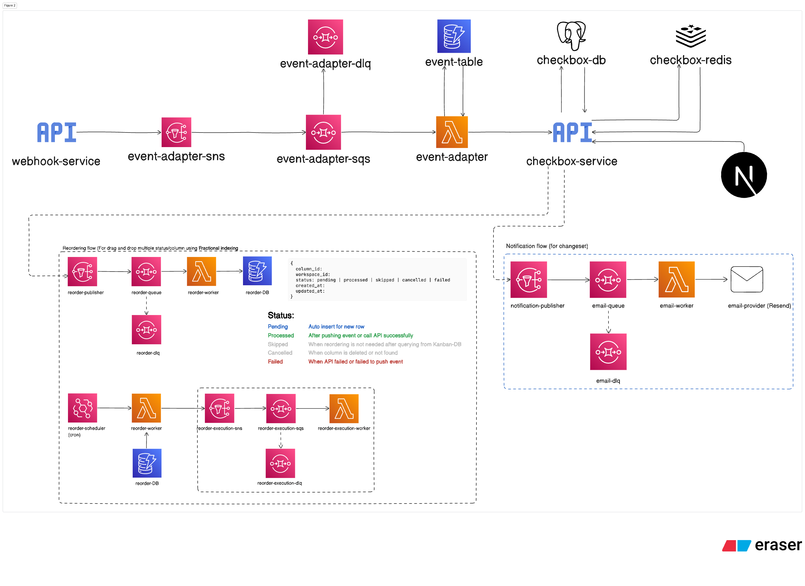

## Jeff Chang's Checkbox.ai assessment

## Table of Contents

- [Project Structure](#project-structure)
- [Project Overview](#project-overview)
- [Assumptions](#assumptions)
- [How to test](#technologies-used)
  - [Setup Instructions](#setup-instructions)
  - [Postman Collection](#postman-collection)
- [Architecture Diagram](#architecture-diagram)
  - [Current state](#current-state)
  - [Future state](#future-state)
- [Things that AI helped me](#things-ai-helped-with)
- [Things that I would do if I have more time](#things-i-would-do-if-i-have-more-time)

## Project Structure

This repository contains total of 4 main folders:

- `Backend`: This is the main backend service that handles incoming webhook events and this will be the source of truth for all contracts. This has been deployed to Vercel
- `Webhook`: This is a separate service that receives webhook events from third-party services and orchestrates the event to any subscriber that's interested to the event. This has been deployed to Vercel
- `Serverless`: This contains the serverless configuration AWS resources/tools such as SQS, SNS, Lambda, and DynamoDB. This has been deployed to AWS
- `Frontend`: This is the frontend application that contains the matter management dashboard and reporting. This has been deployed to Vercel

## Project Overview

### Frontend UI:

#### Matter Management Dashboard & Details

#### Reporting

### AWS Resources

#### SNS Topic

#### SQS Queue

#### Lambda Function

#### DynamoDB Table

### CI/CD Pipeline

1. CI pipeline with unit/integration tests could be found in: https://github.com/Jeffcw96/checkbox-ai-assessment/actions
2. CD pipeline could be found in Vercel dashboard for `Backend` and `Webhook` services & NextJs frontend application

## Assumptions

1. Every user ID that included in the webhook payload (contract creation, new comment and etc) is valid and exists in the system
2. Every contract ID is unique and cannot be duplicated (This is handled in the current implementation by the database unique constraint)
3. Every webhook event is idempotent, meaning that if the same event is received multiple times, it will not create duplicate records or cause any unintended side effects (This is handled in the current implementation by the database unique constraint on the event_id column)

## How to test

### Setup Instructions

Production dashboard URL: https://checkbox-ai-assessment.vercel.app/

1. Make sure you have docker installed in your local machine
2. Clone the repository
3. `make up`
4. cd into `Frontend`, `yarn install` and `yarn dev` to start the frontend application
5. That's it! You can start testing the API using Postman or any API testing tool. Feel free to validate against in Docker GUI. 

### Postman Collection

You can find the Postman collection in the under the [Postman folder](https://github.com/Jeffcw96/checkbox-ai-assessment/tree/master/postman).

**Note**: Make sure you selected the right environment (local or production) before you run and API from the collection.

> We won't be able to test the webhook endpoint in the local environment since it's now connected to the actual AWS SNS topic. You can test the webhook endpoint in the production environment.

The Postman collection contains 2 folders:

1. `Webhook`: This folder contains the same webhook endpoint URL but with different event payload that documented in the assessment requirements
2. `Backend API`: This folder contains the backend API endpoints to get the contract details, list of contracts and reporting that interact with FE. When you are trying with the APIs with `POST` method, please ensure you included the **UNIQUE** `eventId` field otherwise the API will failed.

#### Things to note:

1. Make sure `users.id` and `author` field is valid and existed from the database, you can use the `Get Users` API from the `Backend API` folder to get the list of valid users or feel free to create 1 using the `Create User` API
2. Make sure `contract.id` field is unique in the `contract.created` event and not duplicated or the API will failed
3. Make sure `contract.id` field is already existed in the system when you are testing with other events such as `contract.status_changed`, `contract.comment_added` and etc or the API will failed

## Architecture Diagram

### Current state

### Future state

## Things that AI helped me

I'm not gonna lie, I was mostly getting idea on the following sections from AI (hahaha . . . ):

#### 1. Frontend design & styling

I used Shadcn UI (https://shadcn.com/) for the frontend design and styling. I asked AI to help me with the design and styling of the frontend components, especially to match with the JIRA-liked design

#### 2. Get Report SQL query

I'm struggling to get the data of average time per each status, it's required to compare the next status `changed_at` column and compute the difference time, it's quite hard for me at the first glance so I took AI to help me with the SQL query and do the reverse engineering to understand the query.

## Things that I would do if I have more time

1. Cover more test cases with unit and integration tests
2. Integrate with Redis to reduce the database load for read-heavy operations such as listing of contracts and reporting
3. Add more frontend features such as drag and drop to sort the contract cards, card CRUD
4. Add user login and authentication
5. Add history tracking for contract details/ comments and etc
