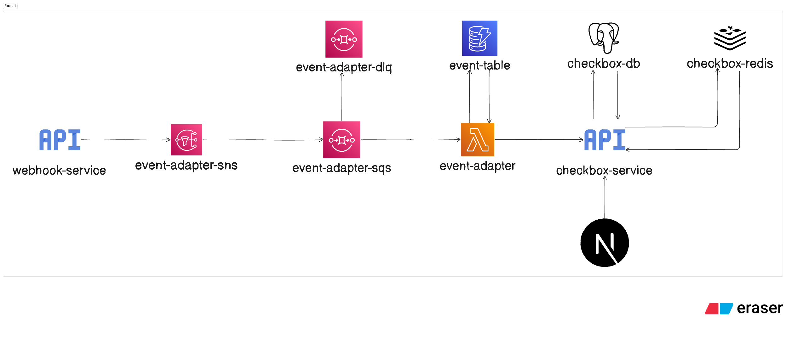

# Welcome to your CDK TypeScript project

This is a blank project for CDK development with TypeScript.

The `cdk.json` file tells the CDK Toolkit how to execute your app.

## Useful commands

- `npm run build` compile typescript to js
- `npm run watch` watch for changes and compile
- `npm run test` perform the jest unit tests
- `npx cdk deploy` deploy this stack to your default AWS account/region
- `npx cdk diff` compare deployed stack with current state
- `npx cdk synth` emits the synthesized CloudFormation template

## Initiate cdk template

`cdk init app --language typescript`

## Architecture diagram



## To Do/ Create:

1. SNS, SQS, Lambda, DynamoDB
2. CI/CD with Github Actions

## Things to consider in the future architecture:

1. Presigned URLs & CDN for documents
2. Replay mechanism for webhooks (DynamoDB status as the sourced of truth)
3. Priority dispatcher queues (urgent vs non-urgent matters)
   3.1 Each dispatcher representing a lambda function associated with the queue
   3.2 All these dispatched lambda will be connected to a single operator lambda function
   3.3 Each dispatcher will have it's own queue
   3.4 We will define the ratio of urgent vs non-urgent matters
   3.5 Operator caller lambda will be invoked by the dispatcher lambda using Lambda async invocation
4. User will be able to update via dashboard besides webhook event
5. It will be publish event to notify the subscribers via email.
6. Sorting matters by rank (priority), Drag and drop to change matters's status
   6.1 This will be using fractional sorting algorithm
   6.2 A Reorder architecture is required

<!-- New: Event Adapter Infrastructure Plan -->

## Event Adapter (Initial Event-Driven Core)

### AWS Resources (Logical Names)

- SNS Topic: event-adapter-sns
- SQS Queue: event-adapter-sqs
- SQS DLQ: event-adapter-dlq
- Lambda: event-adapter
- DynamoDB Table: event-table

### Flow

Publisher (webhook ingestion or internal service) -> SNS (event-adapter-sns) -> SQS (event-adapter-sqs, DLQ on failure) -> Lambda (event-adapter) -> DynamoDB (event-table)

### DynamoDB Schema (event-table)

Partition Key:

- eventID (string) // derived from SQS MessageId or provided UUID

Attributes:

- eventType: string
- status: string
- source: string (e.g. "webhook")
- payload: map (raw event payload)
- createdAt: ISO string
- updatedAt: ISO string
- replayedAt: ISO string | null
- retryCount: number

Future (do later, not now):

- GSI on status (PK: status, SK: createdAt) for dashboards
- GSI on eventType
- TTL for archival

### Idempotency Strategy

Use eventID = SQS MessageId if not present in payload. Conditional Put (attribute_not_exists(eventID)). On retries (when ConditionalCheckFailed) perform Update to increment retryCount and set updatedAt.

### CDK Stack (TypeScript) Outline

```
CheckBoxStack
  SNS Topic (event-adapter-sns)
  DLQ SQS (event-adapter-dlq)
  Main SQS (event-adapter-sqs) with redrive to DLQ
  Subscription: topic -> queue
  DynamoDB Table (event-table)
  Lambda (event-adapter) + SQS event source
  Permissions: lambda -> table (read/write)
```

### Deployment

```
cd infra
npm install
cdk bootstrap   # first time only
cdk deploy
```

### Cleanup

```bash
npx cdk destroy
```
